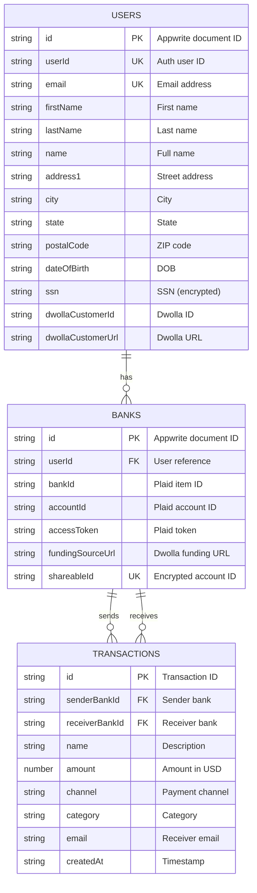

# Database ER Diagram - Horizon Banking Management

## Overview
This project uses **Appwrite** as the backend database with three main collections:
- Users Collection
- Banks Collection  
- Transactions Collection

Additionally, the system integrates with external services (Plaid & Dwolla) for banking data and payment processing.

---

## Database Schema

### 1️⃣ **Users Collection** (`USER_COLLECTION_ID`)

| Field | Type | Description | Constraints |
|-------|------|-------------|-------------|
| `$id` | string | Appwrite document ID | Primary Key, Auto-generated |
| `userId` | string | Appwrite auth user ID | Unique, Required |
| `email` | string | User email address | Unique, Required |
| `firstName` | string | User's first name | Required |
| `lastName` | string | User's last name | Required |
| `name` | string | Full name (computed) | Required |
| `address1` | string | Street address | Required |
| `city` | string | City | Required |
| `state` | string | State/Province | Required |
| `postalCode` | string | ZIP/Postal code | Required |
| `dateOfBirth` | string | Date of birth (ISO format) | Required |
| `ssn` | string | Social Security Number | Required, Encrypted |
| `dwollaCustomerId` | string | Dwolla customer identifier | Unique |
| `dwollaCustomerUrl` | string | Dwolla customer API URL | - |

**Indexes:**
- `userId` (for querying user by auth ID)

---

### 2️⃣ **Banks Collection** (`BANK_COLLECTION_ID`)

| Field | Type | Description | Constraints |
|-------|------|-------------|-------------|
| `$id` | string | Appwrite document ID | Primary Key, Auto-generated |
| `userId` | string | Reference to User | Foreign Key → Users.$id |
| `bankId` | string | Plaid item ID | Required |
| `accountId` | string | Plaid account ID | Required |
| `accessToken` | string | Plaid access token | Required, Encrypted |
| `fundingSourceUrl` | string | Dwolla funding source URL | Required |
| `shareableId` | string | Encrypted account ID for sharing | Unique |

**Indexes:**
- `userId` (for querying banks by user)
- `accountId` (for querying specific bank account)
- `$id` (document lookup)

---

### 3️⃣ **Transactions Collection** (`TRANSACTION_COLLECTION_ID`)

| Field | Type | Description | Constraints |
|-------|------|-------------|-------------|
| `$id` | string | Appwrite document ID | Primary Key, Auto-generated |
| `name` | string | Transaction description/recipient | Required |
| `amount` | number | Transaction amount (in dollars) | Required |
| `channel` | string | Payment channel (e.g., "online") | Required |
| `category` | string | Transaction category | Required |
| `senderBankId` | string | Sender's bank document ID | Foreign Key → Banks.$id |
| `receiverBankId` | string | Receiver's bank document ID | Foreign Key → Banks.$id |
| `email` | string | Receiver's email | Required |
| `$createdAt` | string | Transaction timestamp | Auto-generated |

**Indexes:**
- `senderBankId` (for querying sent transactions)
- `receiverBankId` (for querying received transactions)

---

## Entity Relationships

```
┌─────────────────────────┐
│        USERS            │
│─────────────────────────│
│ PK: $id                 │
│    userId (unique)      │
│    email                │
│    firstName            │
│    lastName             │
│    name                 │
│    address1             │
│    city                 │
│    state                │
│    postalCode           │
│    dateOfBirth          │
│    ssn                  │
│    dwollaCustomerId     │
│    dwollaCustomerUrl    │
└───────────┬─────────────┘
            │
            │ 1:N (One user can have multiple banks)
            │
            ▼
┌─────────────────────────┐
│        BANKS            │
│─────────────────────────│
│ PK: $id                 │
│ FK: userId              │───┐
│    bankId               │   │
│    accountId            │   │
│    accessToken          │   │
│    fundingSourceUrl     │   │
│    shareableId          │   │
└───────────┬─────────────┘   │
            │                 │
            │ 1:N             │ 1:N
            │                 │
            ▼                 ▼
┌─────────────────────────────────────┐
│         TRANSACTIONS                │
│─────────────────────────────────────│
│ PK: $id                             │
│ FK: senderBankId    ────────────────┘
│ FK: receiverBankId  ────────────────┐
│    name                             │
│    amount                           │
│    channel                          │
│    category                         │
│    email                            │
│    $createdAt                       │
└─────────────────────────────────────┘
```

---

## Relationship Details

### 1. **Users ↔ Banks** (One-to-Many)
- **Cardinality:** 1:N
- **Relationship:** One user can connect multiple bank accounts
- **Foreign Key:** `Banks.userId` → `Users.$id`
- **Query Example:**
  ```typescript
  database.listDocuments(DATABASE_ID, BANK_COLLECTION_ID, [
    Query.equal('userId', [userId])
  ])
  ```

### 2. **Banks ↔ Transactions** (One-to-Many)
- **Cardinality:** 1:N (for both sender and receiver)
- **Relationship:** 
  - One bank can send multiple transactions
  - One bank can receive multiple transactions
- **Foreign Keys:** 
  - `Transactions.senderBankId` → `Banks.$id`
  - `Transactions.receiverBankId` → `Banks.$id`
- **Query Example:**
  ```typescript
  // Get transactions where bank is sender
  database.listDocuments(DATABASE_ID, TRANSACTION_COLLECTION_ID, [
    Query.equal('senderBankId', [bankId])
  ])
  
  // Get transactions where bank is receiver
  database.listDocuments(DATABASE_ID, TRANSACTION_COLLECTION_ID, [
    Query.equal('receiverBankId', [bankId])
  ])
  ```

### 3. **Users ↔ Transactions** (Indirect Many-to-Many)
- **Relationship:** Users are related to transactions through their bank accounts
- **Path:** `Users` → `Banks` → `Transactions`
- **Note:** There's no direct foreign key between Users and Transactions

---

## Visual ER Diagram (Mermaid)



---

## External Service Integrations

### 🏦 **Plaid Integration**
- **Purpose:** Fetch real-time banking data
- **Data Stored:** `accessToken`, `bankId`, `accountId` in Banks collection
- **Operations:**
  - Link bank accounts
  - Fetch account balances
  - Retrieve transaction history
  - Get institution information

### 💳 **Dwolla Integration**  
- **Purpose:** Process ACH payments
- **Data Stored:** `dwollaCustomerId`, `dwollaCustomerUrl` in Users; `fundingSourceUrl` in Banks
- **Operations:**
  - Create customer profiles
  - Add funding sources
  - Initiate bank transfers

---

## Data Flow Examples

### **Sign Up Flow:**
```
1. User submits sign-up form
2. Create Appwrite auth account (userId generated)
3. Create Dwolla customer (dwollaCustomerId returned)
4. Create document in Users collection with all data
5. Create session and set cookie
```

### **Add Bank Flow:**
```
1. User connects bank via Plaid Link
2. Exchange public token for access token
3. Fetch account details from Plaid
4. Create processor token for Dwolla
5. Add funding source to Dwolla
6. Create document in Banks collection
```

### **Transfer Money Flow:**
```
1. User initiates transfer
2. Create Dwolla transfer between funding sources
3. Create document in Transactions collection
4. Revalidate affected pages
```

---

## Security Considerations

1. **Encrypted Fields:**
   - `ssn` (Social Security Number)
   - `accessToken` (Plaid tokens)
   - `shareableId` (Encrypted account IDs)

2. **Access Control:**
   - Server-side only operations (`"use server"`)
   - Session-based authentication
   - Admin client for database operations

3. **Data Privacy:**
   - Sensitive banking data stored in Plaid
   - Only references stored in Appwrite
   - No raw financial data in database

---

## Database Environment Variables

```env
APPWRITE_DATABASE_ID=your_database_id
APPWRITE_USER_COLLECTION_ID=your_user_collection_id
APPWRITE_BANK_COLLECTION_ID=your_bank_collection_id
APPWRITE_TRANSACTION_COLLECTION_ID=your_transaction_collection_id
```

---

## Query Patterns

### Get User's Banks:
```typescript
database.listDocuments(DATABASE_ID, BANK_COLLECTION_ID, [
  Query.equal('userId', [userId])
])
```

### Get All Transactions for a Bank:
```typescript
const sent = await database.listDocuments(DATABASE_ID, TRANSACTION_COLLECTION_ID, [
  Query.equal('senderBankId', [bankId])
])

const received = await database.listDocuments(DATABASE_ID, TRANSACTION_COLLECTION_ID, [
  Query.equal('receiverBankId', [bankId])
])
```

### Get User by Auth ID:
```typescript
database.listDocuments(DATABASE_ID, USER_COLLECTION_ID, [
  Query.equal('userId', [authUserId])
])
```

---

## Notes

- All timestamps are auto-generated by Appwrite (`$createdAt`, `$updatedAt`)
- Primary keys (`$id`) are auto-generated by Appwrite using `ID.unique()`
- The system uses server-side rendering with defensive error handling
- Mock data fallbacks exist for development/testing when external services fail

---

## Tools to Visualize

To visualize this ER diagram, you can use:

1. **Mermaid Live Editor:** https://mermaid.live
   - Copy the mermaid diagram code above
   
2. **Draw.io / Diagrams.net:** https://app.diagrams.net
   - Import or manually create the diagram

3. **dbdiagram.io:** https://dbdiagram.io
   - Database schema visualization tool

4. **VS Code Extensions:**
   - "Markdown Preview Mermaid Support" (to view mermaid in VS Code)
   - "Draw.io Integration"

---

*Generated: October 19, 2025*
